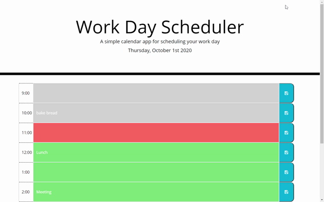

# Planner Application

## Find this project at: 

https://github.com/LindseyM20/planner-application

https://lindseym20.github.io/planner-application/

## Description:

Here you will find files for a simple calendar application that allows the user to save events for each hour of the day. This app will run in the browser and save the user's input for later reference.

The JavaScript and JQuery functionality lends dynamic CSS styling as well as access to local storage, so that the user's entered content persists when the page is refreshed. The date and time are kept current using the Moment.js library.

## Installation:

N/A

## Usage Instructions:

To use this program, use your browser to go to https://lindseym20.github.io/planner-application/

Type in the text fields and click the save button. 

## Credits:

Thank you to my great support system of peers, TAs, tutor, and instructors through the U of M Coding Bootcamp!

In particular:

https://github.com/dfkestner

https://github.com/aanderson120

https://github.com/b-audette

## License:

N/A

